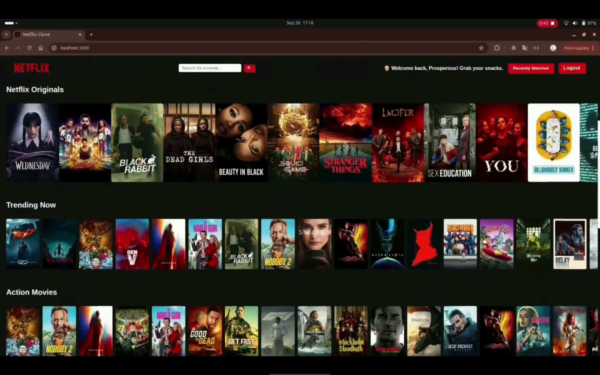

# 🎬 Netflix Clone App

Welcome to the Netflix Clone App — a fun and sleek streaming UI experience where users can explore trending trailers, search for movies, and keep track of what they’ve recently watched.

> Built using Node.js, Express.js, EJS, TMDB API, and YouTube API.

---

## 📸 Features

✅ Netflix-inspired UI  
✅ Dynamic movie rows: Trending, Originals, Action, Comedy, Horror, Romance & Documentaries  
✅ Trailer playback powered by YouTube — plays in the center of the screen  
✅ Search functionality (find any movie!)  
✅ Session-based login/logout  
✅ Personalized welcome message  
✅ Recently Watched tracking per session  
✅ Mobile and desktop responsive

